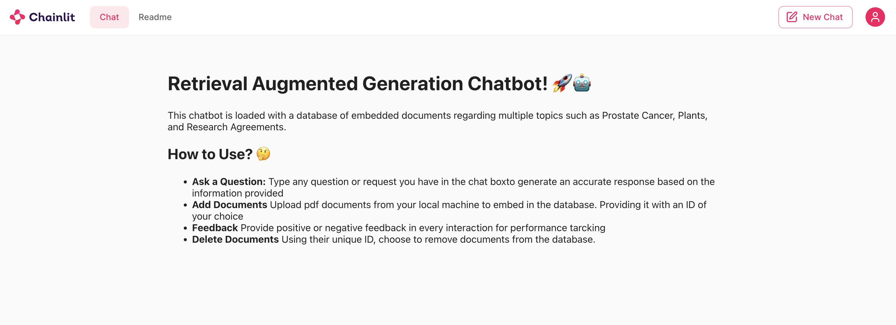

# Chatbot Application with Langchain and Ollama RAG System



This project is a chatbot application that utilizes Langchain and Ollama libraries to manage and process user queries using a large language model (LLM). The application uses a knowledge base created from PDF documents embedded into a vector database, allowing for semantic search and context-based question answering.

**Key features include:**

- **Vector Database**: The application uses Chroma to create a vector database from PDF documents, enabling efficient semantic search.
- **Context-Aware Question Answering**: The chatbot can respond to user queries based on the context provided by the embedded documents.
- **Feedback System**: Users can provide feedback on responses as either "Good" or "Bad" to improve the chatbot's performance.
- **PDF Document Management**: The application allows users to upload, delete, and manage PDF documents within the vector database.

## Table of Contents

- [Installation](#installation)
- [Usage](#usage)
- [Contacts](#contacts)

## Installation

Instructions on how to install and set up your project:

1. Clone the repository:
    ```shell
    git clone https://github.com/joaommata/Project2024
    ```
2. Change into the directory:
    ```shell
    cd yourrepository
    ```
3. Install dependencies:
    ```shell
    I don't know how you should do it, yet hahahah
    ```
    
## Usage

In order to initialize the chatbot in  a local host run the following command :

```shell
# Example command to run your project
chainlit run scripts\appRAG.py
```

## Contacts

- **João Mata**
  - Email: [joao.m.mata@tecnico.ulisboa.pt](mailto:joao.m.mata@tecnico.ulisboa.pt)
